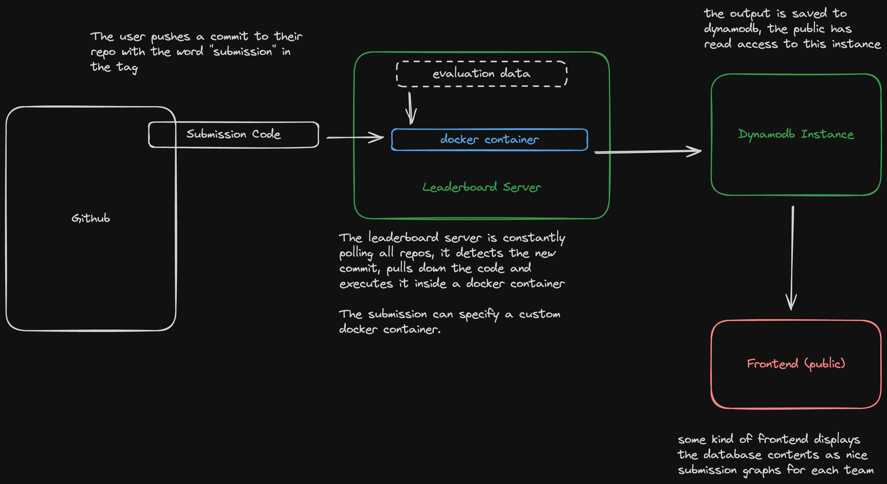

# National Energy Market Hackathon Competition Guide

## Competition Overview

Welcome to the National Energy Market (NEM) Hackathon! In this competition, you'll develop innovative strategies to optimize battery operations within an energy market simulation. Your challenge is to create algorithms, or policies, that expertly manage battery charging and discharging in response to real-time market data.

## Competition Goal

Maximize profits in a simulated energy market by strategically managing battery operations. Your policy will be evaluated over 1000 trials with varying starting conditions, including charge levels, times, and durations.

## System Overview

The submission system looks like this 

If you have forked this repository then "submission code" is this code you are looking at right now. The code running on the leaderboard server is in another repo. More detail on submitting is given below.

## Key Components of the Repository

- **submission_backend**: FOR ADVANCED PARTICIPANTS ONLY. This directory contains the code used to actually run the live leaderboard. We include it here so that participants can guarantee that their submissions will be run by that code without error (see `submission_backend/README.md` for more details).
- **bot/battery_env.py**: The simulation environment for battery-market interactions.
- **bot/evaluate.py**: Tool for testing and evaluating your market strategy.
- **bot/plotting.py**: Utility to visualize outcomes like actions taken, market prices, battery SoC, and profits.
- **bot/policies/**: Folder containing different policy classes for battery operation.
  - **policy.py**: Base class for all strategies.
  - **random.py**: A simple policy making random decisions.
  - **rolling_average.py**: A more complex policy based on market price averages.
  - **starter_code.py**: A template for developing your own policy.
  - **__init__.py**: Script to automatically load and register policy classes.

### Additional Note

- **gen_data.py**: Used for generating synthetic market data, not included in the final repository.

## Installation

### mac/linux

1. Make sure you have python 3.8 or greater
2. Install all python dependencies 
    1. navigate to the root of the project `cd trading-bot-my-team`
    2. `pip install -r bot/requirements.txt`
          4. A good idea is to use [virtualenv](https://www.freecodecamp.org/news/how-to-setup-virtual-environments-in-python/) to keep your local python setup well organized. 
    3. if this worked you should be able to view all your dependencies now with `pip list`
3. Great, now the repo is installed locally. You can check that it is installed correctly by running `python bot/simulate.py`. If all is well it will run for a little while and then print out a graph.

### Windows

God help you.

## Getting Started: Building Your Strategy

### Step 1: Develop Your Policy
Create your custom policy by extending the `Policy` class in `bot/policies/your_policy.py`. Basically what a policy does is choose how much to have the battery charge or discharge at each point in time. A good policy will charge when the market price looks like it's going to be low and discharge when it looks like it will be high.

### Step 2: Test and Evaluate
Use `bot/config.json` to choose which policy to use. You do this by setting "class_name" to the name of the policy class you would like to adopt as your policy for this submission. 

Next utilize `bot/evaluate.py` to run simulations of your policy under various market conditions. This will help you understand the effectiveness of your strategy.

### Step 3: Visualize and Refine
Employ `bot/plotting.py` to graphically analyze the performance of your policy. Use these insights to refine and improve your approach. You can also run a new simulation and plot it straight away uwing `bot/simulate.py`. The plot will look something like:

## Submission and Evaluation

### Dataset Information

- **Development Set**: Market data from April 2023.
- **Training Set**: Entire market data from 2023.
- **Testing Set**: Live market data from late April to early May.

### Submission Guidelines

- Tag your commits with 'submission' to enter them into the competition.
- Keep in mind the limited time frame of the test data when developing your strategy.
- Trial results and other data will be posted on our website (link TBD).

### Important Dates

- **Submission Deadline**: [Insert Deadline Date]
- Ensure your model is properly entered using the submission workflow.

## Final Notes

- Your `bot/config.json` file will be crucial for the submission.
- Though dev test results are not part of the official grading, they are valuable for ensuring your model is correctly entered and functioning.

Best of luck to all participants! We eagerly anticipate your creative and effective solutions in this challenging competition.
